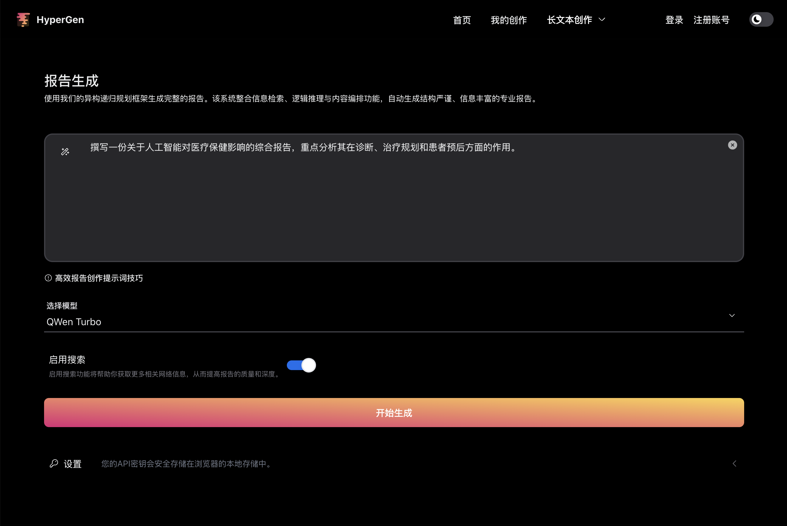
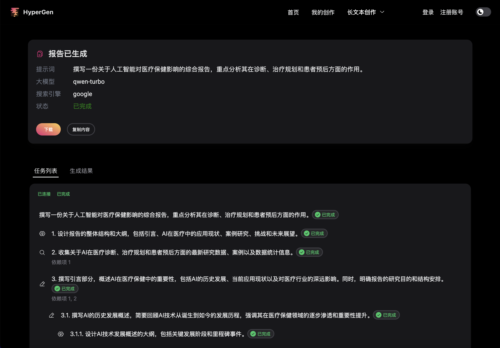

## HyperGen 智能写作助手，让专业报告创作更高效！

<p align="center">
  <a href="https://arxiv.org/abs/2503.08275"></a>
  <a href="https://opensource.org/licenses/MIT"></a>
</p>

HyperGen 是一个参考 [WriteHERE](https://github.com/principia-ai/WriteHERE) 开发的长文本生成应用，对 WriteHERE 原有功能和交互设计进行了优化和调整，同时增加了多语言、多租户、多场景等产品功能的支持。

基于前沿的通用规划技术，HyperGen 通过递归式任务分解与动态集成异构工具，实现自适应内容生成，助您轻松应对营销、学术、商业分析等场景的长文本需求。

✨ 核心亮点

- 一键生成高质量报告
- 本地化部署：安全可控，数据无需上云，保护隐私与机密性。
- 多源搜索支持：无缝整合 Searxng 本地搜索与 SerAPI 商业数据，信息获取更全面。
- 开放生态：兼容 OpenAI API 标准，用户可自定义使用的大模型。未来也将支持多语言/多租户，满足团队协作需求。
- 极简体验：优化 WriteHERE 交互设计，5 分钟快速安装，小白也能上手！

🔧 技术前瞻

- 知识库功能开发中：即将支持本地文档智能检索，让历史资料成为创作素材库。
- 模块化架构：自由扩展写作模板与工具链，适应金融、医疗、政府等垂直领域。

👉 为什么选择 HyperGen？  
不同于云端黑箱工具，我们提供透明可控的 AI 写作工作流，从调研到成稿一气呵成，特别适合：

- 市场团队快速产出竞品分析
- 咨询顾问高效撰写行业报告
- 研究人员整合文献综述

🌟 "就像为每位专业人士配备的写作副驾驶"

注：当前版本暂不支持知识库检索，预计 Q3 发布企业增强版。

### 路线图

- 多语言支持 ( in progress )
- 多租户支持 ( in progress )
- 多场景支持 ( in progress )
- OpenAI-compatible API 支持 ( in progress )
- searxng 支持 ( 已完成 )
- WriteHERE 代码优化 ( in progress )

### 应用截屏

##### 首页


##### 报告生成页面



##### 生成结果页面



### 安装

#### 下载项目代码到本地

```bash
git clone https://github.com/zhiyu/hypergen
cd hypergen
```

#### 安装 uv

参考 https://docs.astral.sh/uv/getting-started/installation/

#### 创建 Python 虚拟环境

```bash
uv venv
```

##### 启动后端服务

1. 安装依赖:

```bash
uv pip install -v -e .
uv sync
```

2. 启动服务:

```bash
uv run python  backend/server.py
```

##### 启动前端服务

1. 安装依赖:

```bash
cd frontend
npm install
```

2. 启动服务:

```bash
npm start
```

### License

[MIT License](LICENSE)
